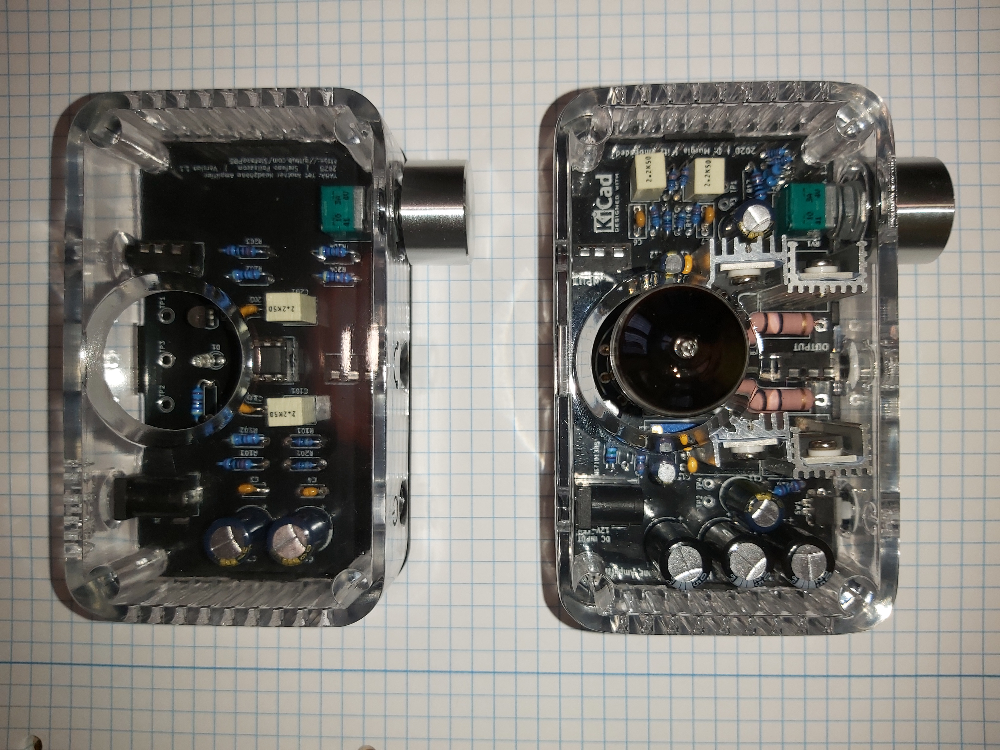

# TubeAmp
TubeAmp: headphone amplifier based on a thermoionic valve, created by Dario Murgia. The real repository is @ [https://github.com/Darmur/tubeamp], I only made a few pictures and share my component list. Please credit the Author, if you want to build this project! 

| Reference | Quantity | Description | Mouser part number | RS part number | AliExpress |
| --------- | -------- | ----------- | ------------------ | -------------- |----------- |
| R1, R2 | 2 | Resistore 2 KΩ 0,125 W | 603-MFR-12FTF52-2K |  | 
| R3 | 1 | Resistore 3,3 KΩ 0,125 W | 603-MFR-12FTF52-3K3 |  | 
| R4, R5 | 2 | Resistore 10 Ω 0,125 W | 603-MFR-12FTF52-10R |  | 
| R6 | 1 | Resistore 5,6 Ω 0,25 W | 603-MFR-25FBF52-5R62 |  | 
| R7, R8 | 2 | Resistore 100 KΩ 0,125 W | 603-MFR-12FTF52-100K |  | 
| R9, R10 | 2 | Resistore 6,8 KΩ 0,125 W | 603-MFR-12FTF52-6K8 |  | 
| R11, R12 | 2 | Resistore 1 MΩ 0,125 W | 603-MFR-12FTF52-1M |  | 
| R13, R14 | 2 | Resistore 150 Ω 0,25 W | 603-MFR-25FTF52-150R |  | 
| R15, R16 | 2 | Resistore 10 Ω 3 W | 603-FMP300JR-73-10R |  | 
| R17, R18 | 2 | Resistore 1 KΩ 0,25 W | 603-MFR-25FBF52-1K |  | 
| RV1 | 1 | Potenziometro doppio audio 50 KΩ | 688-RK09712200HA | 249-9159 | 
| RV2, RV3 | 2 | Trimmer 20 KΩ | 652-3296W-1-203 | 521-9710 | 
| C1, C2, C3 | 3 | Condensatore elettrolitico 1000 µF 25 V | 667-EEU-FP1E102B | 179-3202 | 
| C4, C5 | 2 | Condensatore a film 2,2 µF 63 V | 80-R82CC4220Z370K | 191-985 | 
| C6, C7 | 2 | Condensatore ceramico 68 pF 50 V | 594-K680J15C0GF5TH5 |  | 
| C8, C9 | 2 | Condensatore elettrolitico 100 µF 25 V | 667-EEU-FC1E101S | 449-1040 | 
| C10, C11 | 2 | Condensatore elettrolitico 470 µV 16 V | 667-EEU-FC1C471L | 628-3807 | 
| C12, C13 | 2 | Condensatore elettrolitico 47 µV 25 V | 667-EEU-FC1E470 | 449-1034 | 
| C14, C15 | 2 | Condensatore a film 100 nF 50 V | 594-K104K15X7RF5TH5 | 852-3277 | 
| D1 | 1 | LED blu 3 mm | 630-HLMP-KA45-E0000 | 466-3532 | 
| Q1, Q2 | 2 | IRL510 | 78-IRL510PBF-BE3 |  | 
| U2, U3 | 2 | LM317A | 926-LM317AT/NOPB |  | 
| U1 | 1 | Zoccolo per valvola 12AU7 GZC9-A-G |  |  | 
|  | 1 | Connettore DC | 710-694108301002 | 122-4883 | https://www.aliexpress.com/item/33005175186.html
|  | 2 | Jack audio 1/8" stereo 3P PJ-320A |  |  | https://www.aliexpress.com/item/33029465106.html
|  | 1 | Interruttore |  |  | https://www.aliexpress.com/item/4000316236780.html
|  | 1 | Manopola per potenziometro | 450-225 |  | 

Pictures of the components.

PCB back.

PCB front.

PCB assembled.

Amplifier completed with the 3D printed enclosure.

Amplifier completed with the thermoionic valve, 12AU7.

The TubeAmp from Dario Murgia's next to my YAHA project.

